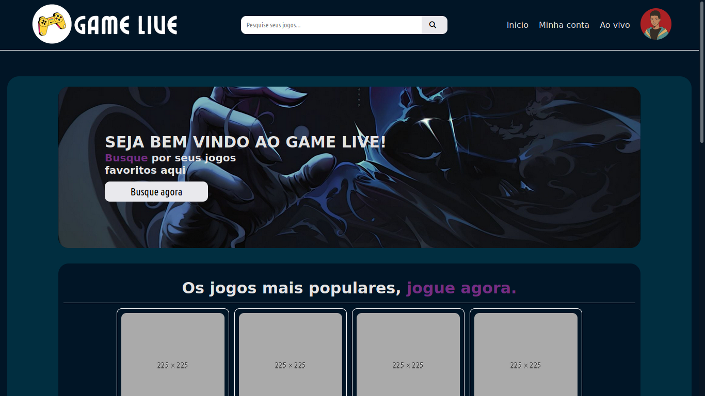
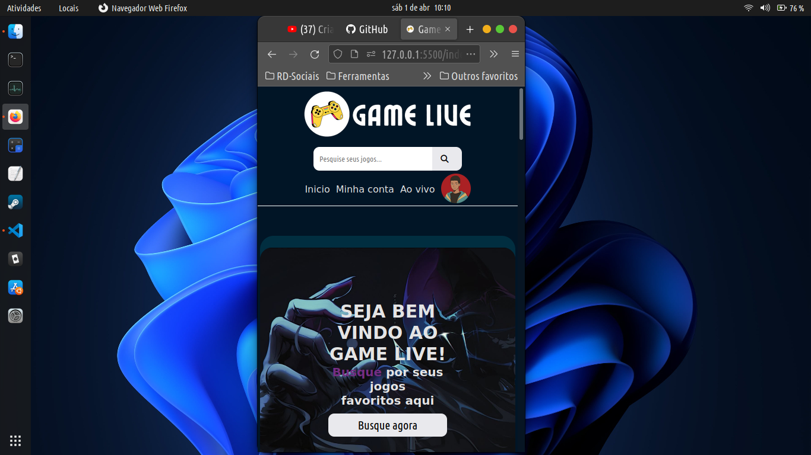
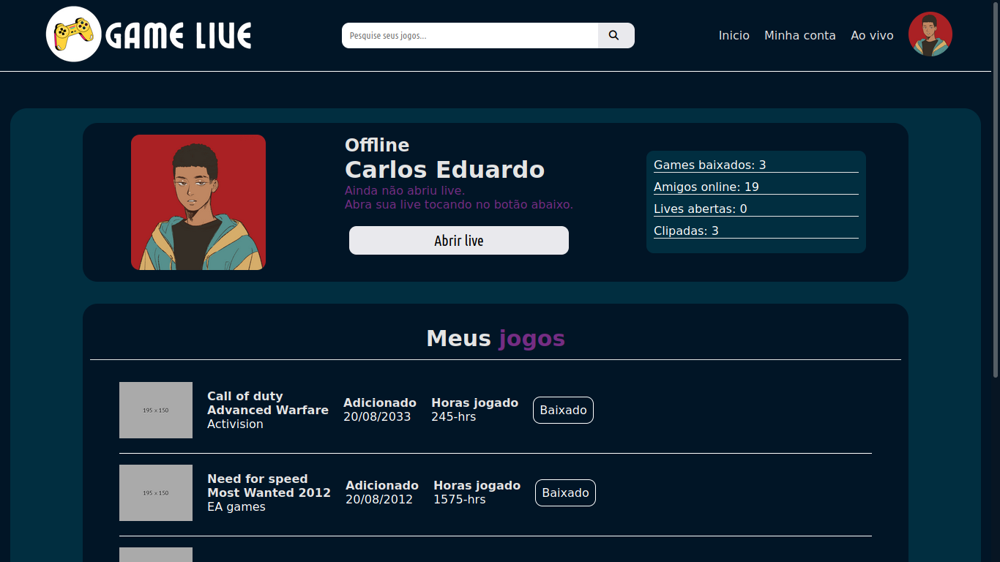
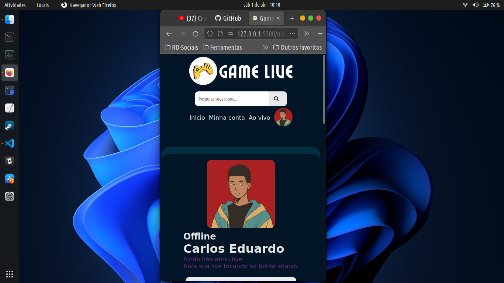

# Bem vindo ao projeto Game Live.

## Índice 
- <a href="#autor">Autor</a>
- <a href="#referências">Referências</a>
- <a href="#layout">Layout</a>
- <a href="#tecnologias">Tecnologias</a>

## Autor
Olá, me chamo Carlos Eduardo e se você assim como eu está trilhando a carreira de Dev-Web, aqui está um projeto com aplicações simples de minha autoria, sinta-se a vontade para clonar este repositório e remodelar este projeto e deixa-lo de seu agrado.

## Referências
Aqui você tem as referências, imagens, fontes base deste projeto.

1. [Twitch Tv](https://www.twitch.tv/)
2. [Wallpaper Flare](https://www.wallpaperflare.com/)
3. [Google Fonts](https://fonts.google.com/)

## Layout
Modelo de responsividade do projeto.

## Tecnologias
Abaixo você tem todas as tecnologias que foram usadas nesse projeto.

1. [HTML](https://www.w3schools.com/html/default.asp)
2. [CSS](https://www.w3schools.com/css/default.asp)
3. [Owl Carousel 2](https://owlcarousel2.github.io/OwlCarousel2/)

